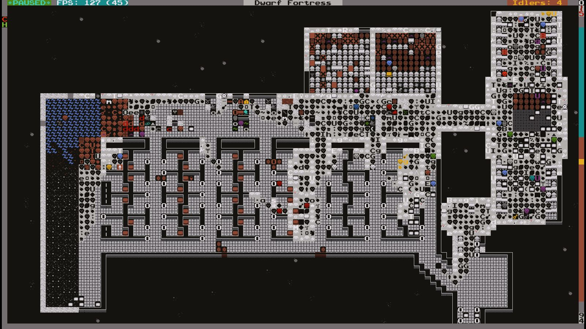
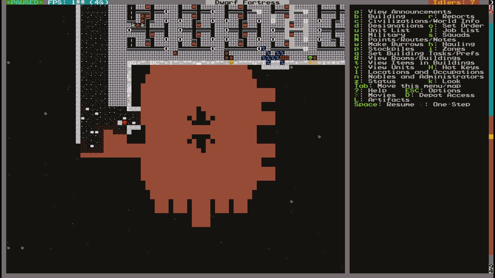
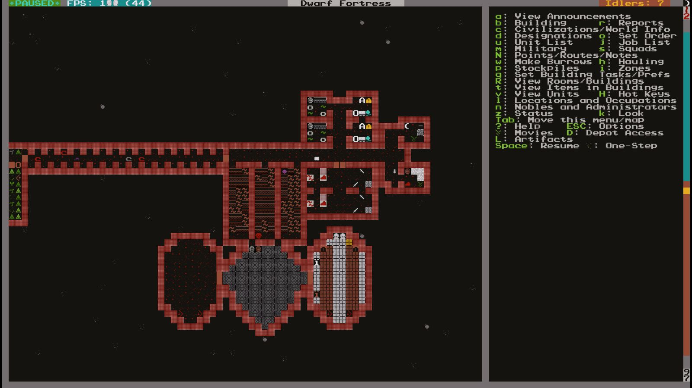
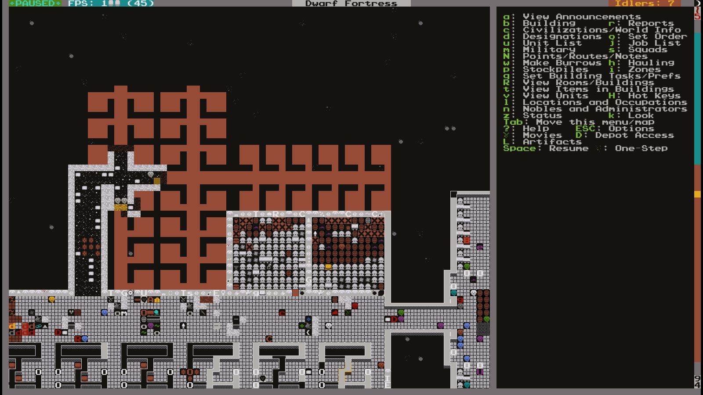
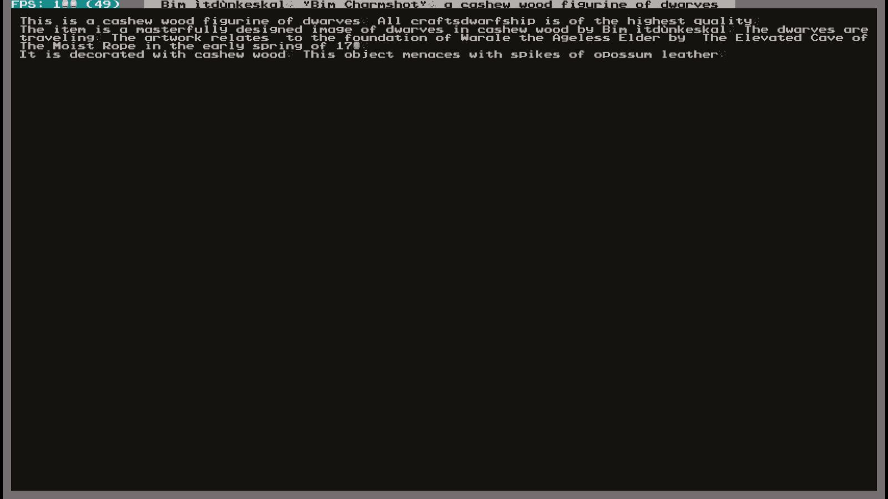
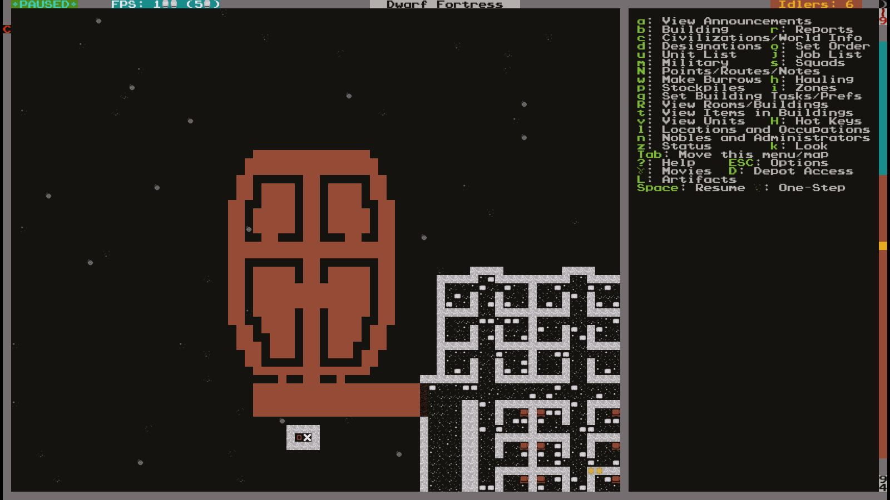
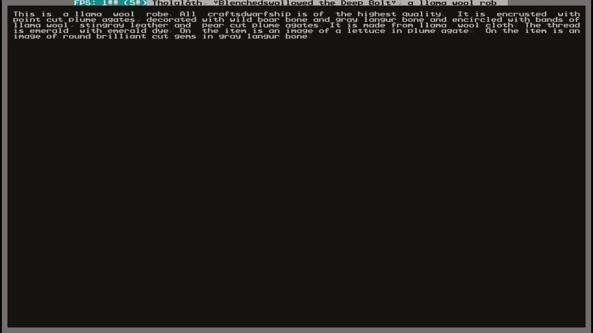
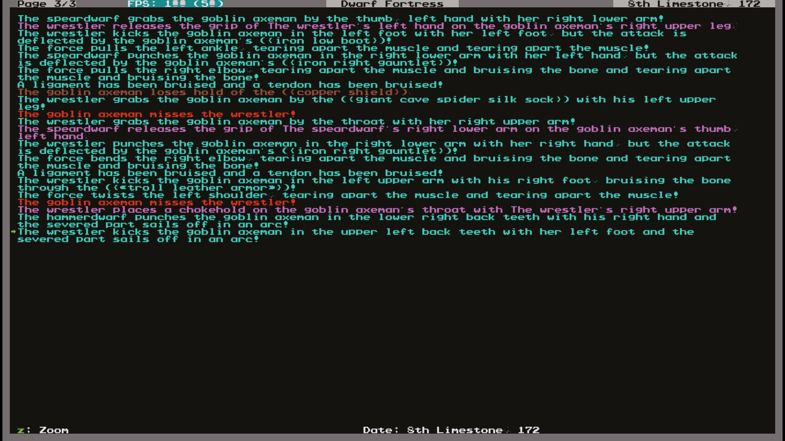
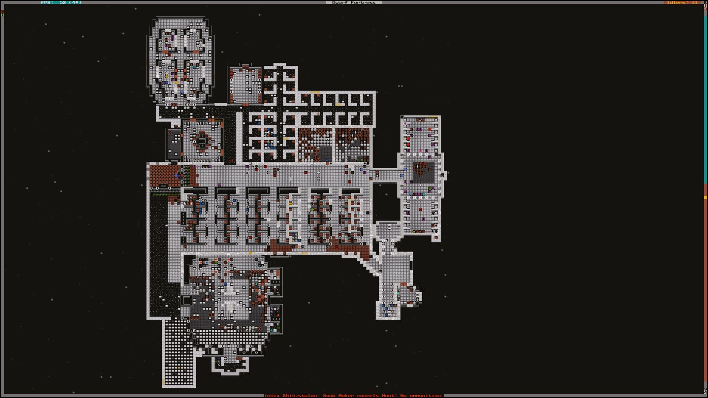

# Pop-Tart’s Reign over WarAle the Ageless Elder

So i’ve been busy at the shop lately, we got a big order of tables and about
thirty...wheelbarrows? I ain’t one to question the boss but I wonder what one can do with so
many baskets on wheels. In the afternoon the boss rings me up as I was sanding down my final
wheels before assembly, says he’s got an opportunity for me, now I ain’t ever opposed to a
promotion, or the possibility of it anyway.

The boss tells me that a new fort was being ran a few days away from the mountain halls and
they needed someone capable of working with wood over there, says it’s a perfect opportunity
to expand the company and he wants me at the helm! I accepted greedily, lured by the promise
of money and potential this job offered, if only I knew. I set off in a hurry, caravan was going off
tomorrow, packed my few belongings and tried sleeping, couldn’t even blink I was so excited. If
only I knew…

## 1st of Granite, 172

So here I was, with about twenty other bearded compatriots I set off to march towards the hold
we were sent to. Boss told me it was called somethin’ like WarAle. Ha! That’s the essence of a
dwarf there if I ever seen one! We went on for a few days, walkin’ through rain and hail, nothing
stopping us and our ambition. We finally arrived there and…..uh...how do I describe it, it wasn’t
what any of us were promised. I don’t know what the folks with me where told but I was
promised a glowing beacon of a fort, the last great bastion of dwarves in this gob-filled world.
What we got was a shithole. First thing we saw was this wooden box of a shack at the entrance
with a wooden bridge acting as the gate. I thought it wasn’t so bad because it’s well known that
every dwarven fort is better underground, but when I got there I was pulling on my beard’s
braids! We walked to the tavern to announce our arrival and talk to the dwarves, when
suddenly, as soon as we started walking down the stairs, we started slipping and falling, the
floor was covered with water and it was all oozing out the walls, falling on us. Some like seeing
the waterfall but I grew mad every minute I stood there! The idiots dug through two layers of
aquifer and just let it flow into the fort! Not even trying to block it!

I got back up and started to angrily walk towards the taverns to talk with the dwarf in charge but
was suddenly blinded by the walls and floors. What is this? **Who ordered this?** I just stood
there, eyes wide. The bleedin’ idiots had engraved **every single walls and floors!** I calmed
myself, more stupefied than angry at this point, I walked to the tavern and started talkin’ with the
dwarves, they didn’t seem to mind, they were used to it no doubt, I asked them where the craft
halls were so I could get started on my job and give good news to the boss. They pointed the
me to the hallway I just came from, I was visibly confused, asking them which way I should go to
see it. They told me every station was right there in the corridor. **At this point I lost it**, I bolted
towards the dormitories, without saying anything more to the dwarves, drank my flask of rum
and passed out.

## 10th of Granite, 172

Since my arrival things have started falling into place, first thing I did was coordinate the
construction of a craft hall for my fellow dwarves to work in, while that was being made I set out
to plug the leaks in the stairwell so it wouldn’t ruin all my wooden furniture that i’ve been
exporting to the capital.

While we fixed the leak it doesn’t change that the bottom half of the stairs is filled with water so i
used my knowledge in woodworking to create a pump at the bottom and water wheel on the
surface to drain it all. I’m currently sitting at my desk, drawing some plans for future projects
while our miners carve out our sewer system and craft hall.

## 5th of Slate, 172

Somehow or other, the dwarves have appointed me as the leader of the fort, must’ve liked my
cabinets. We got a big migrant wave, about 22, it was about time we set out on making new
rooms for the dwarves, sleeping in the taverns was getting old for a few so I told the miners to
carve us some rooms in classic “Pea Pod” style.

One of our farmers came to me today with a petition a “Manifesto of the lower class” as he
called it, must have a few screw loose. He told me the farmers were demanding to form a union,
I asked him if he meant a guild and he looked at me like I was an elf. Union it is then. I asked the
miners to carve out two guild halls next to each other, one for the farmers and the other just in
case. I made sure to ask the miners nicely, else they might get ideas to follow in the farmer’s
steps.

## 10th of Malachite

I always thought the boss of a fortress had a tough job, that I really took a special guy to
manage it all like that, but from what i’ve seen here it’s been pretty much smooth sailing. The
leaks have been plugged, the engravings hidden and we have proper crafting halls. Only thing
of relevance is that the craftsdwarves have demanded a guild as well, I was happy to oblige,
hardworking as they are, they deserve a place to polish and display their skills and who knows,
maybe I’ll learn thing or two myself.

One thing I forgot to mention before was that my fellow wood crafter built a small wooden doll of
himself. He looked at me proud and said it was an artifact, I stood there dumbfounded, ain’t no
way, the other dwarves believed him I said it was horseshit, egotistical maniac…

## 20th of Limestone

Autumn’s come and things have been getting more stressful lately, we’ve found a big sphalerite
deposit and have started to produce cages ​en masse because we’ve heard rumors that some
goblins are mobilizing, we have a gate but...better prepared than dead.

## 1st of Timber, 172

Lately a lot of dwarves have been feeling down, I ask them what’s going on and they say they’re
scared of the god’s “Divine retribution” because they haven’t been praying enough, whatever
that means. If the gods loved the dwarves we wouldn’t be the last standing fort. Anyway, I
ordered for a temple to be build with an altar for two of the most worshipped gods and two
generic ones, hope that fixes it.
We’ve also gotten attacked by rabid badgers two times, no one’s been hurt, but I think it’s in our
best dealin’s to start on a militia, so barracks are now on the way. The miners are getting antsy,
they’ve been building everything and nothing’s been treating them right…

## 6th of Moonstone, 172

Hey wouldja look at that, one of the dwarves got into a crafting fervor and flew off with a few
pieces of cloth and leather, came back a few days later with the nicest robe i’ve ever seen. I’ve
been admiring it and elevating it as ​**the** ​WarAle artifact. I gave it to the Mayor for safekeeping.

## 1st of Opal, 172

Those damn goblins must’ve heard about the artifact, they’ve arrived. It’s only a small advance
party of ten but I won’t take any chances, i’ve called the dwarves in and ordered to shut the
gate. The final cage traps were set down a few days back so they’ve arrived in the nick of time
to try them out.

**By ARMOK I’LL HAVE THE HEAD OF THE KNIFED-EARED TRAITOR WHO DESIGNED THE GATE!**​
The gate wasn’t made to lift, it was made to ​**retract​**, so when the assigned dwarf
pulled the lever which was right next to the gate, hoping for it to close in the goblin’s face, saw it
simply lift upwards! Leaving the fort right open for the little shits! If I ​ever​ meet the predecessor
I’ll have his head! Perchance we had the traps ready and we trapped all but one goblin, which
me and the militia, while untrained, punched the little green man into a ​red​ one, the captain
keeping him in a chokehold while I slammed him with my trusty iron shield I brought from my
home. After that I set on completely remodelling the defence, made the training more intense,
the security airtight and hired a captain of the guard. There should be no more troubles for now.

## 23rd of Opal, 172

This has been a stressful year, too much for me, I ain’t more than a carpenter. I’ve decided to
leave this final survey of the fort and hand it to the next one they pick. I’ll focus more on my
craft, making chests and cabinets for the new migrants and whatnot, training to be one of the
best shield users in the world, ​heh,​ ain't got much competition anyway. So here’s the full fort
drawn here, I take pride in my drawings, gotta draw plans before building furniture. To the top
left is the combined temples, right under is the barracks, to the right is the extended dormitory
and a hospital. The crafting hall is at the bottom.

Here’s the farmlands, only three fields but it’s enough for us, to the right are the farmer’s crafting
stations and at the bottom is the two guild halls (farmer’s on the right, craftsdwarves on the left)
and the food stockpile in the center.

## Afterwords

**The priest spoke:​** “We the dwarves hold this ceremony in the honor of our great friend and
legendary carpenter, Pop-Tart, as the workers called him. He has died bravely, fighting a horde
of more than thirty goblins to buy time for the civilian’s retreat. Even when all his comrades in
arms fell beside him, he did not falter, equipped with his formidable iron shield he took blow
after blow, slash after slash, pushing back the green hordes until the civilians left, he then
departed after a blow to the head, putting the entire fortress in grief. But do not let thine heart be
overcome with grief for it’s by his effort that we are all here today. In his honor as this here
fortress overseer and craftsdwarf, a mausoleum shall be built, with the finest engraved walls
and his mighty shield hung over his tomb. In this day, pop-tart, we lay you to rest. May you
watch over us all.”

**As the priest’s words stopped and the dwarves ceased their crying and once again
started their never-ending work, a secret deal was being made in the mayor’s office, the
next day, the robe was gone and never seen again.**
